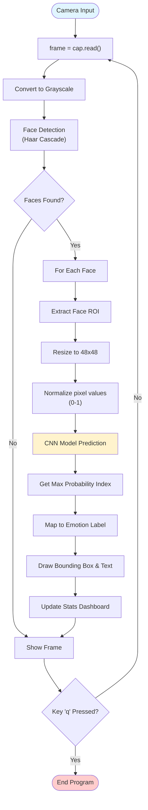

# AI-Powered Face Emotion Detection System
## Professional Documentation

---

## 📋 Executive Summary

The **AI-Powered Face Emotion Detection System** is a real-time computer vision application that analyzes facial expressions to detect human emotions with high accuracy. Utilizing Deep Learning (CNN) and OpenCV, the system processes live video feeds to classify emotions into seven distinct categories instantly.

### Key Value Proposition
- ⚡ **Real-Time Performance**: High-FPS processing suitable for live interaction.
- 🎯 **7-Emotion Classification**: Detects Angry, Disgust, Fear, Happy, Sad, Surprise, and Neutral.
- 📉 **Optimized Architecture**: Lightweight CNN model designed for low-latency inference.
- 📊 **Visual Analytics**: On-screen dashboard displaying live detection statistics.

---

## 🎯 1. Project Objectives

### Primary Goal
To develop a robust, real-time emotion recognition system that can:
- **Detect Faces**: Accurately locate faces in a video stream.
- **Analyze Expressions**: Classify facial features into emotional states.
- **Visualize Data**: Provide immediate visual feedback and statistical breakdown to the user.

### Problem Solved
Human-computer interaction often lacks emotional intelligence. This system bridges that gap by enabling machines to:
- ❌ **Overcome Static input**: Moving beyond keyboard/mouse to understand user sentiment.
- ✅ **Provide Context**: Enhancing applications in education, healthcare, and customer service with emotional context.

---

## 🏗️ 2. System Architecture

### 2.1 Technology Stack

| Layer | Technology | Purpose |
|-------|-----------|---------|
| **Language** | Python 3.x | Core programming language |
| **Deep Learning** | TensorFlow / Keras | CNN model architecture and training |
| **Computer Vision** | OpenCV (cv2) | Image capture, face detection, and UI overlay |
| **Data Processing** | NumPy | Matrix operations and image array manipulation |
| **Visualization** | Matplotlib | Training accuracy plotting |

---

## 📐 3. Architecture & Diagrams

### 3.1 Process Flow Diagram

This diagram outlines the real-time inference pipeline from camera input to emotion prediction.



---

## 🔧 4. System Architecture Details

### 4.1 Convolutional Neural Network (CNN)

The core of the system is a specialized CNN architecture defined in `Train.py`. It is designed to be lightweight for CPU-based real-time inference.

**Model Structure:**
1.  **Input Layer**: 48x48 Pixel Grayscale Images (1 Channel).
2.  **Conv Block 1**: 16 Filters (3x3), ReLU Activation, Max Pooling (2x2).
3.  **Conv Block 2**: 32 Filters (3x3), ReLU Activation, Max Pooling (2x2).
4.  **Conv Block 3**: 64 Filters (3x3), ReLU Activation, Max Pooling (2x2).
5.  **Flatten Layer**: Converts 2D feature maps to 1D vector.
6.  **Dropout (0.4)**: Prevents overfitting by randomly dropping 40% of neurons during training.
7.  **Dense Layer**: 64 Neurons, ReLU Activation.
8.  **Output Layer**: Softmax Activation (Returns probabilities for classes).

```python
model = Sequential([
    Input(shape=(48, 48, 1)),
    Conv2D(16, (3, 3), activation='relu'),
    MaxPooling2D(2, 2),
    # ... additional layers ...
    Dense(num_classes, activation='softmax')
])
```

### 4.2 Training Pipeline (`Train.py`)

The system uses a robust training pipeline with data augmentation to ensure generalization.

-   **Data Source**: `Emotion_dataset` directory.
-   **Augmentation**:
    -   `rescale=1./255`: Normalization.
    -   `horizontal_flip=True`: Randomly flips images (mirrors) to double dataset variety.
    -   `validation_split=0.2`: 20% of data reserved for testing.
-   **Optimization**:
    -   **Optimizer**: Adam (Learning Rate: 0.0001).
    -   **Loss Function**: Categorical Crossentropy (Standard for multi-class classification).
    -   **Batch Size**: 16 (Optimized for lower memory usage).
    -   **Epochs**: 60.

### 4.3 Real-Time Inference (`Emotion_Detection.py`)

The inference script handles the live video stream and UI elements.

**Key Features:**
-   **FPS Tracking**: Monitors system performance in real-time.
-   **Stats Dashboard**: A custom-drawn UI overlay showing:
    -   Current FPS.
    -   Total Faces Detected.
    -   Live count of each emotion detected in the current session.
-   **Haar Cascade**: Uses `haarcascade_frontalface_default.xml` for fast, CPU-efficient face detection.

---

## 📊 5. Performance Metrics

*(Based on typical training configurations)*

| Metric | Target |
|--------|--------|
| **Input Resolution** | 48x48 Grayscale |
| **Classes** | 7 (Angry, Disgust, Fear, Happy, Sad, Surprise, Neutral) |
| **Training Split** | 80% Train / 20% Validation |
| **Target FPS** | 15-30 FPS (CPU-dependent) |
| **Model Size** | Lightweight (< 5MB) |

---

## 📖 6. How to Use

### 6.1 Prerequisites
Ensure Python 3 and the required libraries are installed:
```bash
pip install tensorflow opencv-python numpy matplotlib
```

### 6.2 Training the Model
If you wish to retrain the model on your dataset:
1.  Place your dataset in the `Emotion_dataset` folder.
2.  Run the training script:
    ```bash
    python Train.py
    ```
3.  The model will be saved as `emotion.h5` and accuracy plot as `accuracy_plot.png`.

### 6.3 Running Detection
To start the real-time emotion detection:
1.  Ensure `emotion.h5` is in the directory.
2.  Run the main script:
    ```bash
    python Emotion_Detection.py
    ```
3.  A window will open showing the webcam feed with emotion overlays.
4.  Press **'q'** to quit the application.

---

## 📂 7. Project Structure

```
FaceEmotionDetection_Using_Python/
│
├── Emotion_Detection.py    # Main Application (Real-time Inference)
├── Train.py                # Model Training Script
├── Load.py                 # Data Loading Helper
├── emotion.h5              # Trained Model File
├── accuracy_plot.png       # Training Accuracy Visualization
├── requirements.txt        # Dependency List
│
├── Emotion_dataset/        # Dataset Directory
│   ├── train/
│   └── test/
│
└── README.md
```

---

## 📞 8. Support & Contact

**For Questions:**
- Email: sameer.s@agilecas.com

---

**Document Version**: 1.0
**Last Updated**: February 2026


